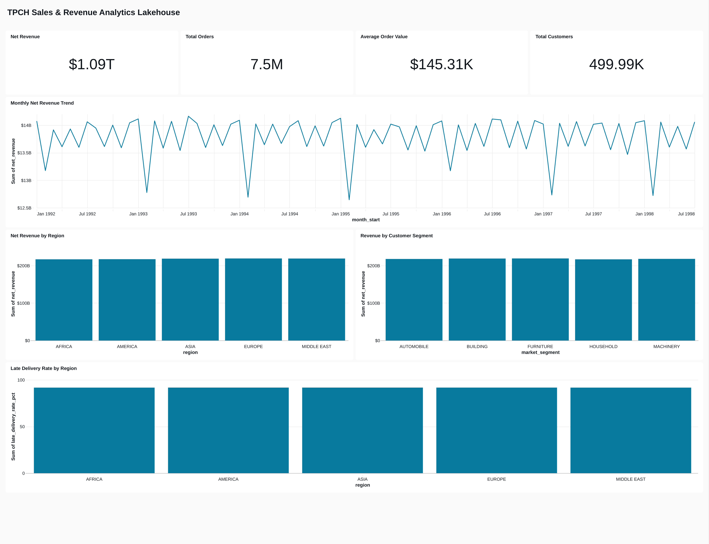
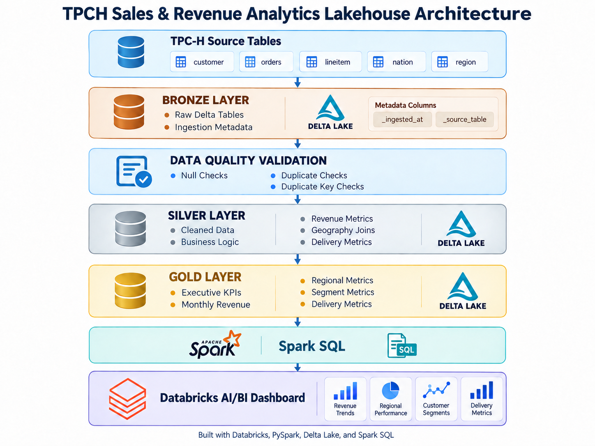

# TPCH Sales & Revenue Analytics Lakehouse

An end-to-end analytics lakehouse project built in Databricks using **PySpark, Delta Lake, Spark SQL, Medallion Architecture, and Databricks AI/BI Dashboards**.

The project transforms the TPC-H benchmark dataset through **Bronze, Silver, and Gold layers** to produce business-ready revenue, customer, regional, and delivery-performance analytics.

---

## Dashboard Preview



---

## Project Overview

This project demonstrates how raw transactional data can be transformed into reliable, business-ready analytical datasets using a modern lakehouse architecture.

The solution covers the complete analytics workflow:

- Raw data ingestion
- Delta Lake storage
- Medallion architecture
- Data-quality validation
- Data cleaning and transformation
- Multi-table joins
- Revenue calculations
- Customer and geographic enrichment
- Business KPI development
- Spark SQL analytics
- Interactive dashboard development

---

## Business Objective

The objective of the project is to build an analytics solution capable of answering business questions such as:

- What is total net revenue?
- How many orders and customers are represented?
- What is the average order value?
- How does revenue change over time?
- Which geographic regions generate the most revenue?
- Which customer segments contribute the most revenue?
- What proportion of deliveries are late?
- How does delivery performance vary across regions?

---

## Architecture



The project follows a **Medallion Architecture**:

```text
TPC-H Source Tables
        |
        v
+---------------------------+
|       BRONZE LAYER        |
|                           |
| Raw Delta Tables          |
| Ingestion Metadata        |
+-------------+-------------+
              |
              v
+---------------------------+
| DATA QUALITY VALIDATION   |
|                           |
| Null Checks               |
| Duplicate Checks          |
| Duplicate Key Checks      |
+-------------+-------------+
              |
              v
+---------------------------+
|       SILVER LAYER        |
|                           |
| Cleaned Data              |
| Business Logic            |
| Revenue Metrics           |
| Geography Joins           |
| Delivery Metrics          |
+-------------+-------------+
              |
              v
+---------------------------+
|        GOLD LAYER         |
|                           |
| Executive KPIs            |
| Monthly Revenue           |
| Regional Metrics          |
| Segment Metrics           |
| Delivery Metrics          |
+-------------+-------------+
              |
              v
          Spark SQL
              |
              v
      Databricks AI/BI
           Dashboard
```

---

## Technology Stack

- Databricks
- Apache Spark
- PySpark
- Spark SQL
- Delta Lake
- Python
- Databricks AI/BI Dashboards
- Git
- GitHub

---

## Dataset

The project uses the **TPC-H benchmark dataset** available in Databricks under the:

```text
samples.tpch
```

schema.

Core source tables used:

- `customer`
- `orders`
- `lineitem`
- `nation`
- `region`

TPC-H is a synthetic decision-support benchmark dataset.

Therefore, all revenue, customer, order, and delivery metrics shown in this project are **simulated** and should not be interpreted as real company performance.

---

# Medallion Architecture

## Bronze Layer

The Bronze layer ingests the original TPC-H source tables into Delta tables while preserving the raw source structure.

Additional ingestion metadata is added to support traceability:

- `_ingested_at`
- `_source_table`

Bronze tables created:

- `customer`
- `orders`
- `lineitem`
- `nation`
- `region`

The Bronze layer provides a reliable raw-data foundation for downstream transformations.

The project dynamically uses the active Databricks catalog rather than hard-coding a specific workspace catalog.

---

## Silver Layer

The Silver layer performs data-quality validation, cleansing, enrichment, and business transformations.

### Data Quality Checks

The project performs:

- Null-value profiling
- Duplicate customer-key checks
- Duplicate order-key checks
- Duplicate line-item checks
- Duplicate business-key checks

### Customer Enrichment

Customer records are enriched by joining:

```text
Customer
   |
   v
Nation
   |
   v
Region
```

This adds geographic dimensions such as:

- Nation
- Region
- Market segment

### Order Transformations

Order data is enhanced with:

- Standardized column names
- Order year
- Order month
- Order priority
- Customer relationships

### Revenue Calculations

The line-item data is transformed into analytical revenue measures.

```text
Discount Amount =
Extended Price × Discount Rate
```

```text
Net Revenue =
Extended Price × (1 - Discount Rate)
```

```text
Revenue with Tax =
Extended Price × (1 - Discount Rate) × (1 + Tax Rate)
```

### Delivery Metrics

Operational metrics are also derived.

```text
Shipping Days =
Receipt Date - Ship Date
```

A delivery is flagged as late when:

```text
Receipt Date > Commit Date
```

Silver tables created:

- `customer`
- `orders`
- `lineitem`

---

## Gold Layer

The Gold layer converts transformed Silver datasets into business-ready analytical tables.

These tables are designed for reporting, KPI development, and dashboard consumption.

### `order_performance`

A consolidated order-level analytical fact table containing:

- Order information
- Customer information
- Geographic information
- Gross revenue
- Discounts
- Net revenue
- Revenue including tax
- Quantity
- Shipping performance
- Late-delivery indicators

---

### `executive_kpis`

Provides executive-level metrics:

- Total Orders
- Total Customers
- Gross Revenue
- Total Discounts
- Net Revenue
- Average Order Value
- Average Shipping Days
- Late Delivery Rate

---

### `monthly_revenue`

Provides monthly business-performance metrics:

- Total Orders
- Unique Customers
- Net Revenue
- Average Order Value

---

### `regional_performance`

Provides regional analytics:

- Total Orders
- Customer Count
- Net Revenue
- Average Order Value
- Late Delivery Rate

---

### `segment_performance`

Provides analytics by customer market segment:

- Customer Count
- Total Orders
- Net Revenue
- Average Order Value
- Total Discounts

TPC-H market segments include:

- Automobile
- Building
- Furniture
- Household
- Machinery

---

### `delivery_performance`

Provides operational delivery analytics by region and year:

- Total Orders
- Average Shipping Days
- Late Orders
- Late Delivery Rate

---

# Dashboard

The final Databricks AI/BI dashboard is titled:

**TPCH Sales & Revenue Analytics Lakehouse**

It contains four executive KPI cards:

- Net Revenue
- Total Orders
- Average Order Value
- Total Customers

It also contains analytical visualizations for:

- Monthly Net Revenue Trend
- Net Revenue by Region
- Revenue by Customer Segment
- Late Delivery Rate by Region

---

## Dashboard Metrics

The benchmark dataset produced approximately:

| KPI | Value |
|---|---:|
| Net Revenue | $1.09T |
| Total Orders | 7.5M |
| Average Order Value | $145.31K |
| Total Customers | 499.99K |

These values are derived from the synthetic TPC-H benchmark dataset and do not represent real company financial results.

---

# Data Quality and Analytical Decisions

## Incomplete Final Reporting Month

During dashboard validation, the source order data was checked using:

```sql
SELECT
    MIN(order_date) AS min_order_date,
    MAX(order_date) AS max_order_date
FROM your_catalog.tpch_silver.orders;
```

The dataset covers:

```text
Minimum Order Date: 1992-01-01
Maximum Order Date: 1998-08-02
```

Because August 1998 contains only two days of data, including it in the monthly revenue trend produces an artificial decline.

The incomplete final month is therefore excluded **only from the trend visualization**.

The underlying Bronze, Silver, and Gold datasets remain unchanged.

This prevents incomplete-period revenue from being incorrectly interpreted as a genuine decline in business performance.

---

## Monthly Trend Query

The final dashboard uses a real monthly date field:

```sql
SELECT
    MAKE_DATE(order_year, order_month, 1) AS month_start,
    total_orders,
    unique_customers,
    net_revenue,
    avg_order_value
FROM your_catalog.tpch_gold.monthly_revenue
WHERE MAKE_DATE(order_year, order_month, 1) <
      DATE_TRUNC(
          'MONTH',
          (
              SELECT MAX(order_date)
              FROM your_catalog.tpch_silver.orders
          )
      )
ORDER BY month_start;
```

Using a real date field creates a cleaner time-series axis and prevents an incomplete final month from distorting the trend.

`your_catalog` represents the active Databricks catalog in which the Bronze, Silver, and Gold schemas are created.

---

# Repository Structure

```text
databricks-tpch-analytics-lakehouse/
│
├── notebooks/
│   ├── 01_TPCH_Data_Exploration.py
│   ├── 02_TPCH_Bronze_Layer.py
│   ├── 03_TPCH_Silver_Layer.py
│   └── 04_TPCH_Gold_Layer.py
│
├── dashboard/
│   ├── tpch_dashboard.png
│   └── TPCH Sales & Revenue Analytics Lakehouse.lvdash.json
│
├── docs/
│   └── architecture.png
│
├── .gitignore
└── README.md
```

The dashboard PDF export is intentionally excluded because Databricks PDF exports can contain workspace-specific link metadata.

---

# Notebook Workflow

The notebooks are intended to be executed sequentially.

```text
01_TPCH_Data_Exploration.py
        ↓
02_TPCH_Bronze_Layer.py
        ↓
03_TPCH_Silver_Layer.py
        ↓
04_TPCH_Gold_Layer.py
        ↓
Databricks AI/BI Dashboard
```

---

## `01_TPCH_Data_Exploration.py`

Explores the Databricks sample environment and inspects the TPC-H source datasets.

Tasks include:

- Listing available catalogs
- Listing schemas
- Inspecting TPC-H tables
- Exploring customer data
- Exploring order data
- Exploring line-item data

---

## `02_TPCH_Bronze_Layer.py`

Builds the ingestion layer of the lakehouse.

Tasks include:

- Detecting the active Databricks catalog
- Creating Bronze, Silver, and Gold schemas
- Reading TPC-H source tables
- Adding ingestion timestamps
- Adding source-table metadata
- Writing Delta tables

---

## `03_TPCH_Silver_Layer.py`

Builds the cleaned and transformed analytical layer.

Tasks include:

- Row-count validation
- Null profiling
- Duplicate-key checks
- Customer geography enrichment
- Column standardization
- Revenue calculations
- Discount calculations
- Shipping-duration calculation
- Late-delivery identification
- Writing Silver Delta tables

---

## `04_TPCH_Gold_Layer.py`

Builds business-ready analytical datasets.

Tasks include:

- Aggregating line items to order level
- Building an order-performance fact table
- Creating executive KPIs
- Building monthly revenue metrics
- Building regional-performance metrics
- Building customer-segment metrics
- Building delivery-performance metrics
- Writing Gold Delta tables

---

# Skills Demonstrated

This project demonstrates practical experience across data engineering, analytics, modeling, and business intelligence.

## Data Engineering

- Databricks
- PySpark
- Apache Spark
- Delta Lake
- ETL / ELT workflows
- Medallion architecture
- Data transformation
- Data ingestion
- Data-quality validation

## Data Analytics

- Spark SQL
- Revenue analysis
- Customer segmentation
- Regional analysis
- Operational analytics
- KPI development
- Trend analysis
- Business reporting

## Data Modeling

- Relational joins
- Duplicate-key validation
- Analytical fact tables
- Aggregated reporting tables
- Customer geography enrichment

## Business Intelligence

- Databricks AI/BI Dashboards
- Executive KPI cards
- Time-series analysis
- Regional comparisons
- Customer-segment analysis
- Delivery-performance reporting

## Software and Workflow

- Python
- Git
- GitHub
- Reproducible notebook workflows

---

# Key Learning Outcomes

Through this project, I gained hands-on experience with:

- Designing a Databricks lakehouse architecture
- Implementing Bronze, Silver, and Gold layers
- Working with PySpark DataFrames
- Creating Delta tables
- Performing data-quality validation
- Developing reusable business metrics
- Building analytical Gold tables
- Querying data using Spark SQL
- Designing an interactive Databricks dashboard
- Identifying and correcting misleading incomplete-period trends
- Packaging a data project for GitHub and portfolio presentation

---

# Future Enhancements

Potential future improvements include:

- Automated Databricks Workflows
- Incremental ingestion
- Lakeflow pipelines
- Data-quality expectations
- Unit testing
- CI/CD integration
- Dimensional modeling
- Automated dashboard refresh
- Revenue forecasting
- Anomaly detection
- Additional operational KPIs

---

# Project Files

## Databricks Notebooks

The complete PySpark workflow is available in:

```text
notebooks/
```

The four exported Databricks notebooks contain the complete exploration, Bronze, Silver, and Gold workflow.

## Dashboard

Dashboard assets are available in:

```text
dashboard/
```

The folder contains:

- Dashboard screenshot
- Databricks `.lvdash.json` dashboard definition

## Architecture

The lakehouse architecture diagram is available in:

```text
docs/architecture.png
```

---

# Reproducing the Project

The project is designed to run in a Databricks environment with access to the built-in TPC-H sample dataset.

The source data is read from:

```text
samples.tpch
```

The transformation notebooks dynamically detect the active catalog:

```python
current_catalog = spark.sql("SELECT current_catalog()").first()[0]
```

The project then creates:

```text
tpch_bronze
tpch_silver
tpch_gold
```

schemas inside that catalog.

Run the notebooks sequentially:

```text
01_TPCH_Data_Exploration.py
02_TPCH_Bronze_Layer.py
03_TPCH_Silver_Layer.py
04_TPCH_Gold_Layer.py
```

The exported `.lvdash.json` file documents the dashboard definition and SQL used for the analytical visualizations.

---

# Author

**Avikumar Patel**

GitHub: [AvikumarPatel](https://github.com/AvikumarPatel)

---

# Disclaimer

This project was developed for educational and portfolio purposes using the synthetic TPC-H benchmark dataset.

All financial, customer, order, regional, and delivery metrics shown in this repository are simulated benchmark results and do not represent the performance of a real organization.
